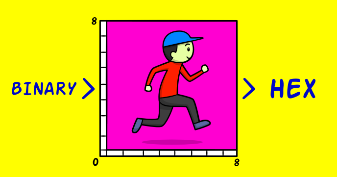

Display a custom message using bitmap characters.

While implementing this program, you’ll learn about:

-	Binary numbers
-	Store character definition in binary as bitmaps
-	Print a message using bitmap characters

See also: [Colorful letters](tutorial://colorful_letters)
 
## Source code 
The JavaScript source code of this program can be found [here](sketches/program.js). To run it, you need to import it in the [codeguppy.com](https://codeguppy.com) online editor. Alternatively, you can use the source code in your p5.js sketches (advanced use). 
## Online version 
To see the code running, check the online playground at [https://codeguppy.com/code.html?t=user_characters](https://codeguppy.com/code.html?t=user_characters) 
## Next steps 
Please check [codeguppy.com](https://codeguppy.com) for many other fun JavaScript programs and games for beginners. To stay up to date with CodeGuppy development please follow [@codeguppy](https://twitter.com/codeguppy) on Twitter.  
